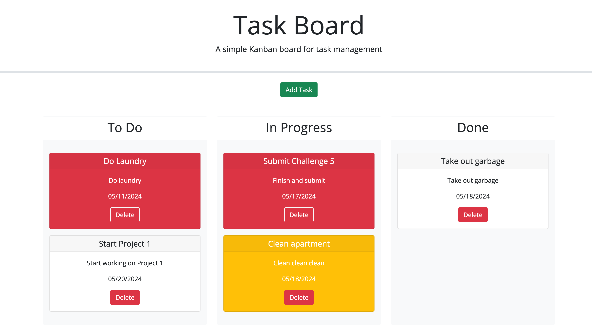

# Task-Board

## Description

For this challenge I was given starter code for a task board application, for task management. Originally, the code just had three empty columns; one for "To Do", "In Progress", and "Done" tasks. It also contained an "Add Task" button that did nothing. The application uses different colors to indicate priority of the tasks by due-date. White is used for tasks due in the future or already done, yellow is used for tasks due the current day, and red is used for tasks that are past due. These differently colored cards are created and rendered to the screen when the user enters their tasks into the modal pop up. The user can drag the cards to the appropriate column to keep track of their tasks, and also delete the cards completely when they are no longer needed.

This challenge proved the most difficult yet. I started with adding a modal from Bootstrap and then adding a datepicker from jQuery Ui, to that modal. I then modified the modal to match the mockup. Then I started with the handleAddTask function, which uses the information from the user, to create a task object and then push the tasks to an array. The array is saved to local storage and used frequently throughout the rest of the code. Then I needed to get the tasks to show up on the screen. I used the createTaskCard function to create all the HTML elements and assign them to Bootstrap classes to style. I had to use a conditional statement to determine the color of the card based on the user entered due date. Then the renderTaskList function was used to append the card to the "To Do" column, to start with. I had to use a for loop to then append the tasks to the proper columns, based on where the user drags the cards to. The cards unique ID was used from the generateTaskId to make sure the ID from the card matched the ID from the object, thus changing the status, and appending it to the correct column with the matching status state of the card and object. 

## Installation

N/A

## Usage

The user is presented with a blank task board application. There are three columns, one for "To Do" tasks, "In Progress" tasks, and "Done" tasks. By clicking the "Add Task" button, a modal (made using Bootstrap) pops up on the screen and the user is prompted to enter the task title, due date, and description. The datepicker from jQuery UI, makes selecting a date easy. By clicking the "Add Task" button again, the task is confirmed and it appears on the screen in the "To Do" column. From here, the user can add as many tasks as they want. A task due in the future will create a white card, a task due today will create a yellow card, and a past-due task will create a red card. The cards can be dragged and dropped into any column the user wants. All cards put in the "Done" column will turn white, regardless of the color they started in. When the user no longer needs a task card on the board, it can be deleted by clicking the red "Delete" button, and it will be removed. Refreshing the page will not erase or change the position of any of the cards. The user can add and delete task cards as much as they like. 

[Click here]() to view deployed application.

## Credits

Used third party libraries Bootstrap, jQuery, jQuery UI, and Day.js.

## License

N/A